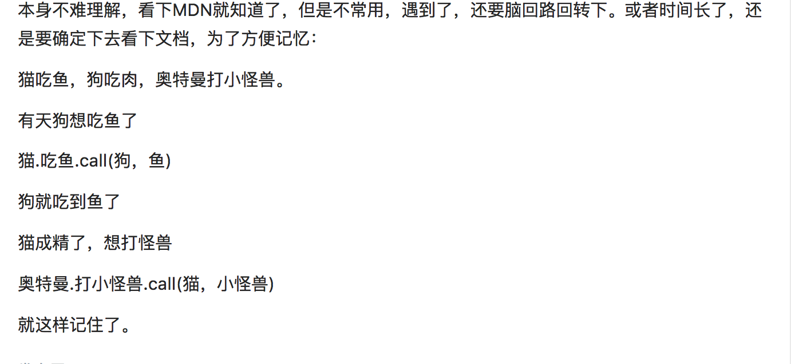

# Different with `call` and `apply` and `bind`
 

言简意赅，方便记忆。

代码点～～

```js
//cat
function Cat(){}

Cat.prototype.eat = function(food){
    console.log('eat', food);
}

function Dog(){
    this.name = 'pitty'
}
// now, dog want to eat something, but he don't have `eat` method , so~~~
Cat.prototype.eat.call(Dog,'fish') // => eat fish 
Cat.prototype.eat.apply(Dog,['fish']) // => eat fish 
// now, dog eat fish successfully,but cat crying in corner !!~.~ .
```

different with `call` and `apply`
`Function.propertype.call(thisArg, arg1, arg2, ...) // 参数是一个个顺序参数` 
`Function.propertype.apply(thisArg, [arg1, arg2, ...]) // 参数为参数组成的数组`

`call` & `apply`  and `bind`

 [`Function.propertype.bind`参考](https://developer.mozilla.org/zh-CN/docs/Web/JavaScript/Reference/Global_Objects/Function/bind)
```js 
// bind 返回是一个新的函数，与被绑定的函数拥有相同的函数体
const eatFish = Cat.propertype.eat.bind(Dog);
eatFish('fish'); // => eat fish
or 
const eatfish = Cat.propertype.eat.bind(Dog,'fish');
eatFish(); // => eat fish
```

